# Night at the Museum

[Udacity VR Nanodegree project 2](https://eu.udacity.com/course/vr-developer-nanodegree--nd017)

## Introduction 
This is **project 2** for the [VR Nanodegree programme](https://eu.udacity.com/course/vr-developer-nanodegree--nd017) from [Udacity](www.udacity.com) where the objective was to conduct research on companies, applications and/or industries that have/could be impacted by VR and how. The findings of this research is then to be presented in an VR experience. 

This document describes the research, VR experience, and process in developing the VR experience.  

# Research 
Virtual Reality (VR) is often criticized as a medium which will pull us further into isolation where our societies will be drawn further into the digital realm and disconnect from reality.  

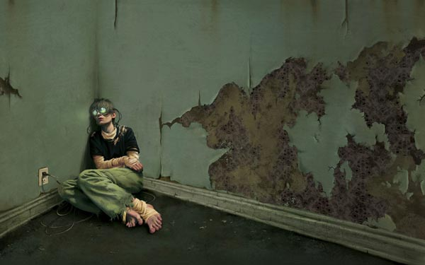  

But I would argue against this and would argue that VR is a medium which encourages and supports intimate engagement (ventually) and in this report I present companies and their offerings which support **Social VR** - the topic of my research.  

Before presenting the companies and their offerings; let's first explore how we communicate with one another and the evolution of Human Computer Interaction (HCI).  

## Effective communication 
Similar to VR, mobile has been criticized for making our societies more anti-social but the [number one activity on mobile is communication and social media](https://www.statista.com/statistics/294377/popular-daily-smartphone-tablet-activities-us/) i.e. engaging with friends and family members. **But** communicating with only text (including emojis) and a flat screen is an incredibly inefficient channel to communicate on as researcher *Albert Mehrabian* highlights 55% of communication comes from body language, 35% from tone of voice, leaving only [7% for the words actual used](https://ubiquity.acm.org/article.cfm?id=2043156).  

## Evolution of how we interact with computers
The other relevant point is the evolution of how we interact with computers. [Mark Billinghurst](http://www.markbillinghurst.com/index.html), computer interface researcher, highlights our progression towards natural user interfaces over time - as seen in the figure below.  

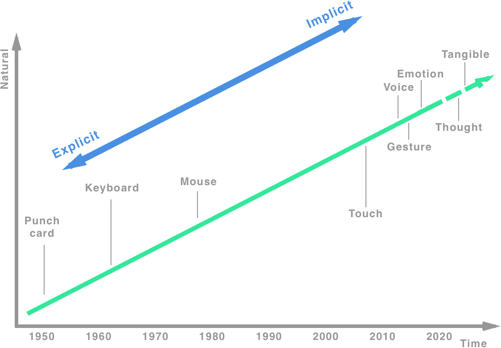  

This plot not only highlights the diminishing friction between us and computers (natural user interfaces) but also how our interactions are shifting from being explicit to implicit. What is enabling this is *sensing* technologies that are capable of capturing our voice, pose, emotion, and context. These same technologies provide a rich toolset of projecting our current state into VR therefore allowing for **effective communication** i.e. VR provides an expressive medium allowing for more natural communicaiton.  

Let's now explore some how some companies are leveraging VR's innate charactertics of supporting intimate experiences by offering social platforms. 

## Social VR 
Oxford dictionary defines social as *an informal social gathering, especially one organized by the members of a particular club or group.* The following is a small survey of some of the many companies which are offering VR experiences where socialising is an important aspect of it. 

### [Altspace VR](https://altvr.com/)
Having raiseed over $15.7M in seed and recently being acquired by Microsoft, Altspace VR is one of the leading social platforms for VR we have to date. The platform allows user to meet people from all around the world, hosts live events and play interactive gaes with friends - or just hang out.  

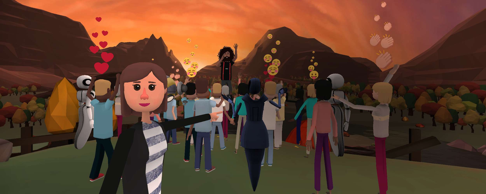  

Altspace VR makes events a prominent feature of the platform; as with real events - social success is depedent on resonating with a motivated audience and, unlike asynchronous such as Facebook status updates etc, requires real-time interactions between people were-by events provide an ideal vehicle to facilitate this.

### [Facebook Spaces](https://www.facebook.com/spaces)
An obivous contender for anything social related is, of course, Facebook. Having acquired by Oculus makes Facebook a dominate player in social VR. There platform is still under beta which provides a good indication of where the industry is i.e. it is still very much in its infancy and designer and developers are still working on how best users can engage in the medium. 

  

One prominent feature of Facebook Spaces is its extensive range of customisable avatars thus highlighting self-image as an important aspect of social VR experiences. Along with customising your avatar, it also allows you to watch videos, examine 360-degree photos, draw in 3D and take selfies with up to three of your Facebook friends sharing your space. But unlike Altspace VR, Facebook Spaces is confined to just your friends (or rather Facebook connections). 

### [BBC Sport](https://www.bbc.co.uk/sport/football/44038006)
It's not just start-ups or digital native companies but event traditional media companies are starting to embrace VR as another medium. This year (2018) BBC announced that will be be streaming all 2018 FIFA World Cup games in its BBC Sport VR.

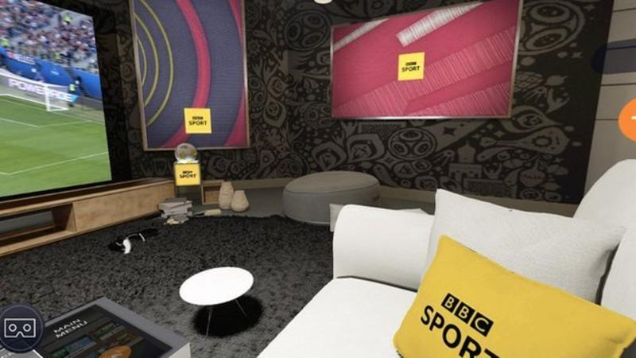  

The games in VR will be enhanced with commentary from Match of the Day and a live stats dashboard with real-time match information.

### [Big Screen VR](https://bigscreenvr.com/)
Big Screen VR's proposition is offering a virtual venue for big screen viewing (live events, similar to BBC Sport VR, or gaming). Similar to Atlspace VR, Big Screen VR's platform supports and promotes events - again highlighting the dependency on synchronous behaviour for social interaction.

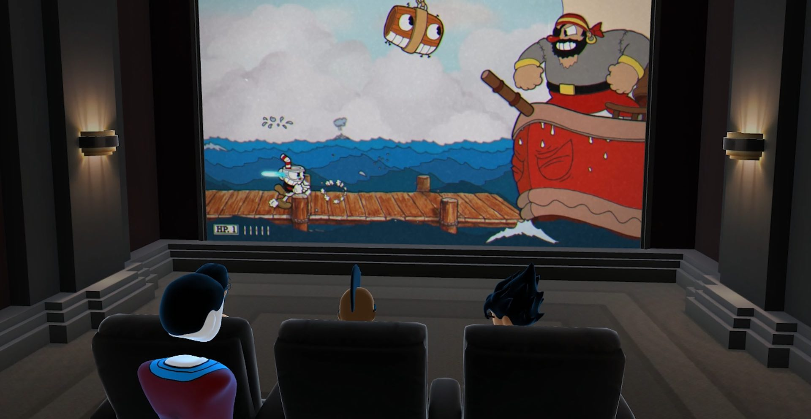 

### [Mozilla Hubs](https://blog.mozilla.org/blog/2018/04/26/enabling-social-experiences-using-mixed-reality-and-the-open-web/)
So far we have introduced expereinces that require install a client to access the experience, Mozilla Hubs brings Social VR to the ubiquitous web platform. Offering users the same familiar behaviour of discovering and accessing web pages but replacing the pages with an immersive envrionment, in this case a social environment.  

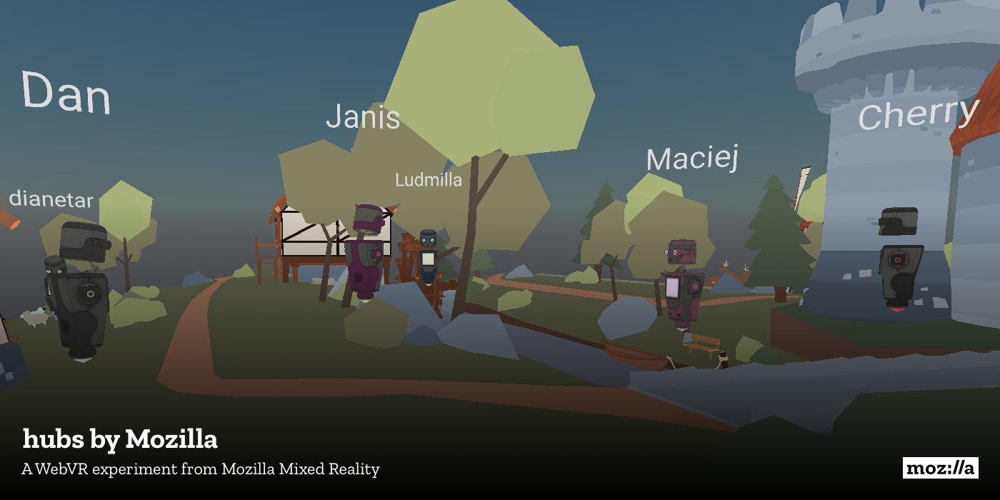 

### Others 
Here we have only listed a few of the many players; others include: 
- Sansar; Social platform from the developers of SecondLife 
- SlotsMillion VR; VR environment for gambling 
- Rec Room; VR environment allowing users to partake in a multitude of sports-style games, from ping pong to basketball to disc golf.

... to name a few.  

Although not a comprehensive survey of the exiting Social VR market; it does highlight some important considerations (importance of self-image, self-expression and synchronicity) as well as the markets interest.  

In the next second we introduce the project and then walk through the journey of creating it. 

# VR Experience 
Night at the Museum is an environment modelled (as the name suggests) as a, somewhat, traditional museum where artifacts have been put on display allowing the user to explore and investigate anything that interests them.  

A virtual avatar (assistant) has been used to help introduce the user to the environment and provide a mechanism for relaying the details of each artifact. When the user first enters the environment **Exe**, the virtual avatar, introduces herself and explains how the user navigates around the environment and interacts with the artifacts. Once the introductions are complete; *Exe* follows the user as they navigate themselves around the environment and re-engages with them only when prompted to describe the details of the selected artifact.  

The artifacts of the environment are metaphors used to describe the types of social applications currently out in the market; they include: 
- Travel 
- Gaming 
- Viewing  

Finally another artifact used to intoduce some general principles of **Social VR**.  
Each artifact is associated with a brief extract which is communicated via voice and text via **Exe**. The figure fly-thru below shows the final version. 

<a href="https://www.youtube.com/embed/qWzti4JNCyE?ecver=1" target="_blank">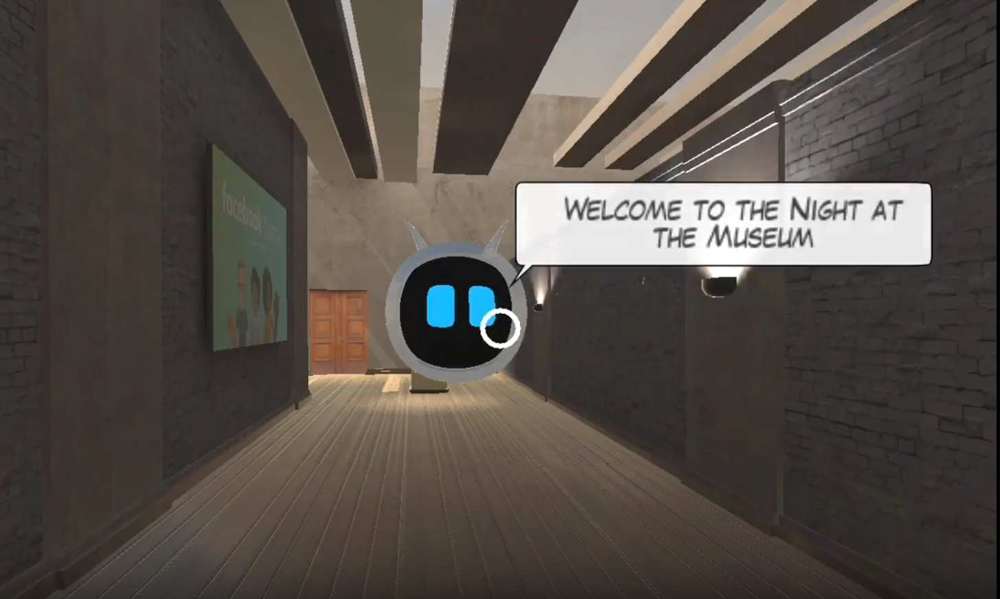</a>

Now we have a concrete idea of what was developed; let's explore how it was developed. 

# Process 
In this section we look at the journey of developing **Night at the Museum**, starting with the initial concept and then the development of each of the major components, including: 
- Evironment design 
- Locomotion 
- Interactivity 

## User Persona(s) 
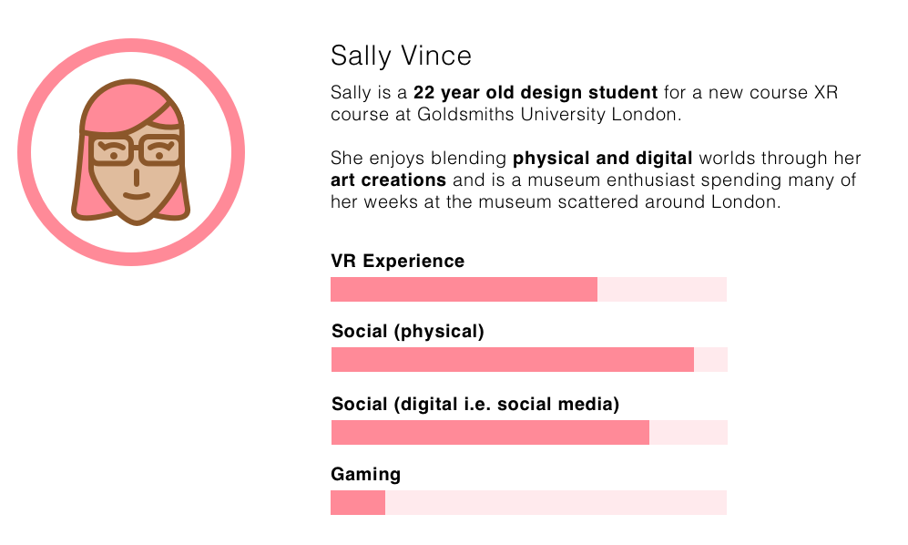 

## Concept sketch 
The environment is to feel familar to the user, something akin to a typical museum where exhibits are placed around the environment for the user to interact with. The following sketch illustrates the environment layout. 

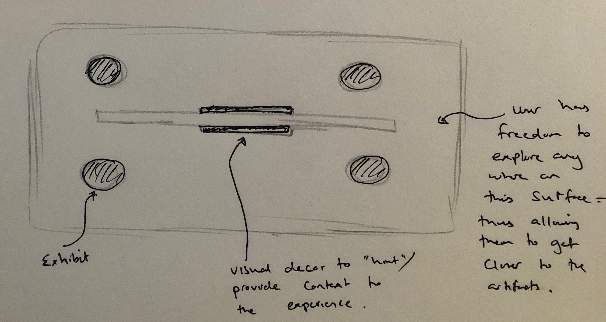 

The next sketch illustrates the general flow. 

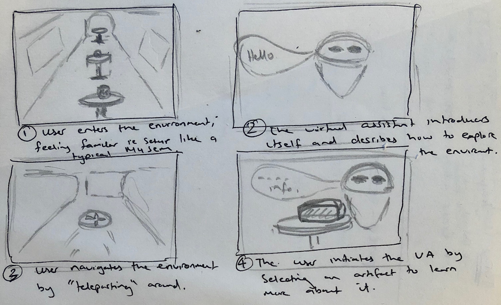 

With our user persona and concept sketched; lets turn our attention to the design of the experience starting with the environment. 

## Iteration 1 (Environment)
The desired look and feel was something that would feel familar to the user; the environment would be metaphoric to help the user understand the context and how they should engage and explore the environment.  
Luckily due to the thriving Unity community I managed to find something very simialr to what I was going for; the [Show Room](https://assetstore.unity.com/packages/3d/environments/showroom-environment-73740) environment by [Nova Shade](https://assetstore.unity.com/publishers/17229).  

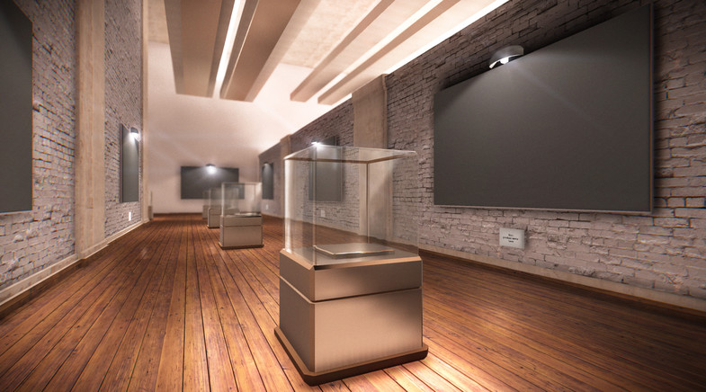 

The base was kept but contents simplified just to how the items I wanted to include. 

The following image shows the artifacts that were used; along with their related **social VR theme**. 

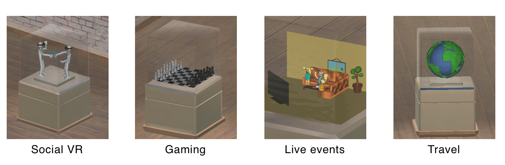 

### User Test  
The user test consisted of empty cabnets where-by the user was situated in the center allowing them to move 360 degrees but remain stationary. The following lists the questions and answers. 
- **Describe the environment:** Type of gallery 
- **Purpose of environment:** View art 

## Iteration 2 (Locomotion)  
The goal was to provide a **simple** mechanism to allow the user freely roam the environment. This was to allow the user to position themselves near the artefacts so they could comfortably see the items but also encourage them to explore the environment themselves to increase realism and engagement.

The mechanism used was teleportation using the cursor (fixed to the users gaze) to set the destination.    

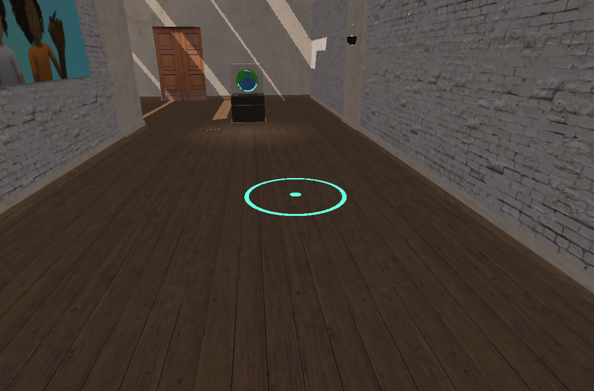 

### User Test  
The user test consisted of the environment and ability for the user to navigate around using teleportation. The following lists the questions and answers. 
- **How did you find the speed:** A little slow.
- **Was there are sense of nausea:** No - it was too slow.

*After testing I tweaked the tween speed and re-tested.* 

## Iteration 3 (Interactivity)  
After selecting a specific artifact, the user would be provided the details via the virtual assistant (**Exe**) using text and speech. The reason for this was to avoid *floating* text in the environment as well as provide the user a sense of company and support through-out the experience.  

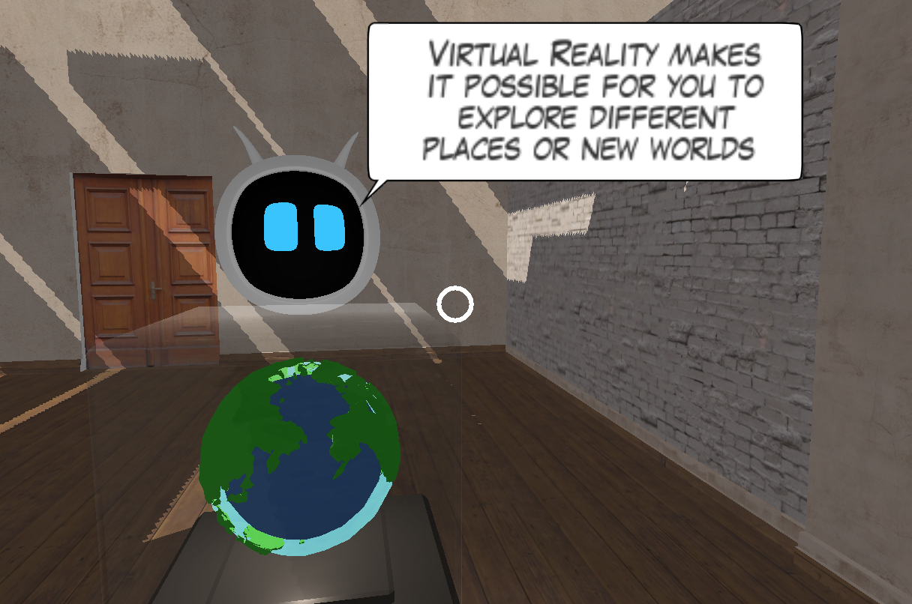   

### User Test  
The test here was concerned with our intuitive the experience was and highlight any painpoints. The user was asked to interact with the environment and then observed. 

*The test revealed some issues around activation and placement of the virtual assistant i.e. the virtual assistant would position themselves in an inconvenient place. This was mitigated by adding a constraint to trigger the artifiact which appeared to resolve a lot of these issues.* 

## Conclusion 
Here we have introduced an valuable characteristic of VR; a platform that is often criticized for making people less social but we can see there is a lot of effort and focus in quiet the opposite - using VR to bring people together.  

The report highlighted this by presenting some companies and their applications which have social at their core. This information was then presented in a VR environment. 

# References 

## Research links (industry) 
- [World Cup: Experience World Cup in Virtual Reality](https://www.bbc.co.uk/sport/football/44038006)
- [Top Five VR Social Experiences](https://www.vrfocus.com/2017/08/top-five-vr-social-experiences/)
- [9 Virtual Reality Startups Taking VR Mainstream](https://www.nanalyze.com/2017/12/9-virtual-reality-startups-vr-mainstream/) 
- [7 Virtual Reality Startups Targeting Social Media VR](https://www.nanalyze.com/2017/07/7-virtual-reality-social-media-vr/)
- [Will virtual reality change how we use social media?](http://rewind.co/interactive-vr/virtual-reality-social-media/)
- [List Of The Most Popular Social VR Platforms](https://www.vrandfun.com/popular-social-vr-platform-list/)
- [Firefox Maker Mozilla Starts Testing Social VR Hubs](https://variety.com/2018/digital/news/mozilla-hubs-social-vr-1202788529/)
- [Oculus Venues is bringing VR users concerts, sporting events, and movie nights—all live, in three dimensions, and surrounded by hundreds of strangers.](https://www.wired.com/story/oculus-venues/)

## Platforms 
- https://hubs.mozilla.com/
- [Second Life](https://en.wikipedia.org/wiki/Second_Life)

## Companies 
- https://bigscreenvr.com/

## Development links 
- https://developers.google.com/vr/develop/best-practices/perf-best-practices
- https://developers.google.com/vr/develop/unity/download
- https://unity3d.com/learn/tutorials/topics/virtual-reality/user-interfaces-vr
- https://www.ibm.com/watson/services/text-to-speech/
- https://text-to-speech-demo.ng.bluemix.net

## 3D models used (credit) 
- **Cheering people:** https://poly.google.com/view/4ewdqwqYjkX
- **Chessboard:** https://www.blendswap.com/blends/view/55802
- **Low poly globe:** https://www.blendswap.com/blends/view/55802
- **Couch scene:** https://www.blendswap.com/blends/view/76223 
- **Television:** https://www.blendswap.com/blends/view/91413
- **Brindis in VR:** https://poly.google.com/view/1LEn1QiZeFo
- **Show room:** https://assetstore.unity.com/packages/3d/environments/showroom-environment-73740  